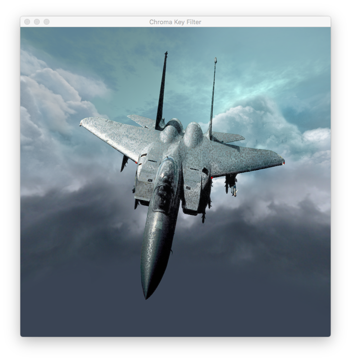
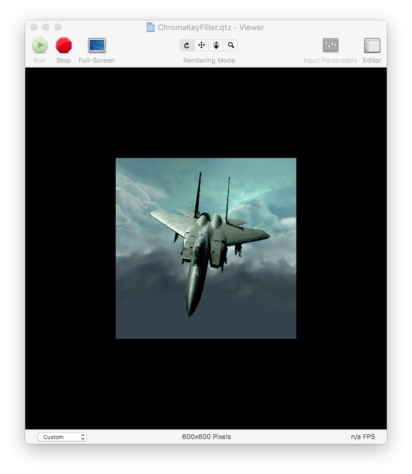
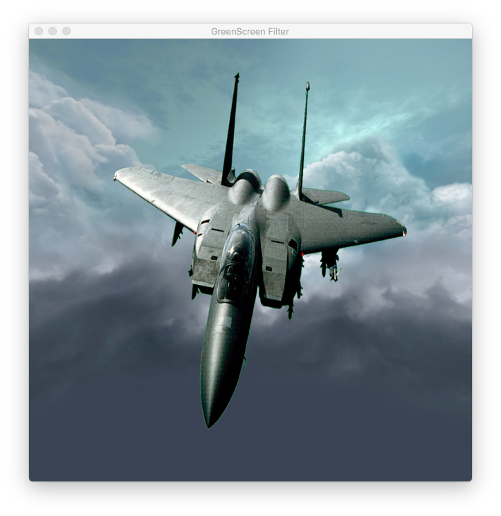

## Chroma Key Filter Recipe

 
 

The source code of this demo is based on Apple's available documentation, online or distributed with XCode 8.x.

 
 

**Expected Output:**

 
 

Added a Swift playground to this repository. Its source code is based on Apple's online ChromaKey Effect article.

 
 

Added a Quartz Composition to this repository.

 
 

Added a macOS application implementing CIFilter to this repository. The source code of the kernel is a modified version of GSChromaFilter.cikernel from Apple's AVGreenScreenPlayer.

 
 

Added a macOS application implementing CIFilter in a metal shader to this repository. 

 
 

**Requirements:**

XCode 8.x, Swift 3.0

Deployment Target: macOS 10.12.

The Metal demo requires 

XCode 9.x, Swift 4.1

 
 

**References:**

1) Core Image Programming Guide.

https://developer.apple.com/library/archive/documentation/GraphicsImaging/Conceptual/CoreImaging/ci_filer_recipes/ci_filter_recipes.html#/

 
 

2) Latest online documentation on Chroma Key Effect:

https://developer.apple.com/documentation/coreimage/applying_a_chroma_key_effect

 
 

3) CIFunHouse - ChromaKey module.

https://developer.apple.com/library/etc/redirect/xcode/content/1189/samplecode/CIFunHouse/Introduction/Intro.html

 
 

**Acknowledgements** due to whoever had made the 2 graphic files available.
